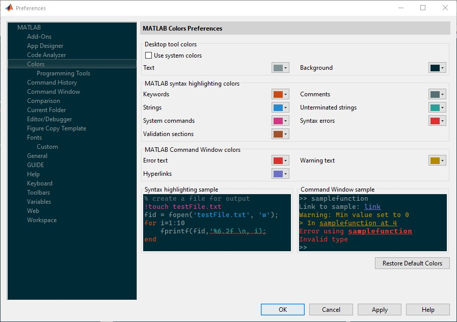

ในแต่ละวัน ถ้าคุณต้องนั่งต้อง MATLAB นานๆ โดยค่า default ของสีของหน้าต่างที่ตั้งค่าก็ไม่ค่อยจะเป็นมิตรกับสายตาสักเท่าไร   
วันนี้เราจึงต้องมาเปลี่ยนสีหน้าต่าง โดยเลือกเป็นชุดสีที่เข้ากัน color theme ที่นิยมใช้กันในหมู่ developer

## เปลี่ยนง่ายๆ ที่ Perferences
วิธีการง่ายที่สุดไปเปลียนที่ Perferences -> Colors แล้วค่อยๆ เลือกที่ละสี ดูตามรูปเลย



## ใช้ code เปลี่ยนโดย matlab-schemer

เข้าไปที่ [matlab-schemer](https://github.com/scottclowe/matlab-schemer)
ดาวน์โหลดมาไว้ในเครื่อง จะโหลดธรรมดา หรือ git clone ก็สะดวกดี

เข้าไปที่ folder แล้วเรียก function *schemer_import* อันนี้เอาไว้เลือกเปลี่ยนชุดสี โดยชุดสี เป็นไฟล์เก็บข้อมูลไว้ที่ folder *schemes*  เป็นนามสกุล prf สมมุติว่าจะเปลี่ยนเป็น 'solarized-light' ก็ให้พิมพ์

```MATLAB
schemer_import('./schemes/solarized-light.prf')
```
สีหน้าต่างก็เปลี่ยนเป็นตามชุดสีที่เลือก

พอเปลี่ยนแล้วก็จะเปลี่ยนเลย ปิดโปรแกรมแล้วเปิดใหม่ก็ไม่เปลี่ยน ไม่ต้อง add path คือเปลี่ยนแล้ว ถ้าจะไม่เปลี่ยนอีกก็ลบ folder ไปได้แล้ว เพราะเสมือนว่าเราไปปรับเปลี่ยนที่ Colors แล้ว

ลองเปลี่ยนกันดู เพื่อสายตาที่สบายมากขึ้น
